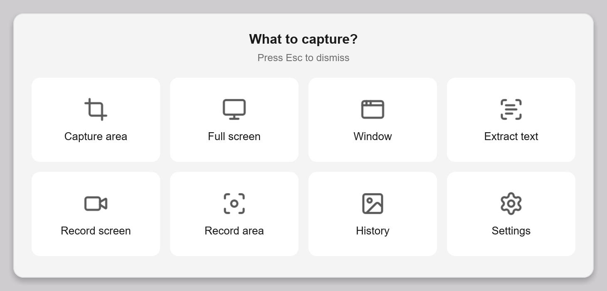
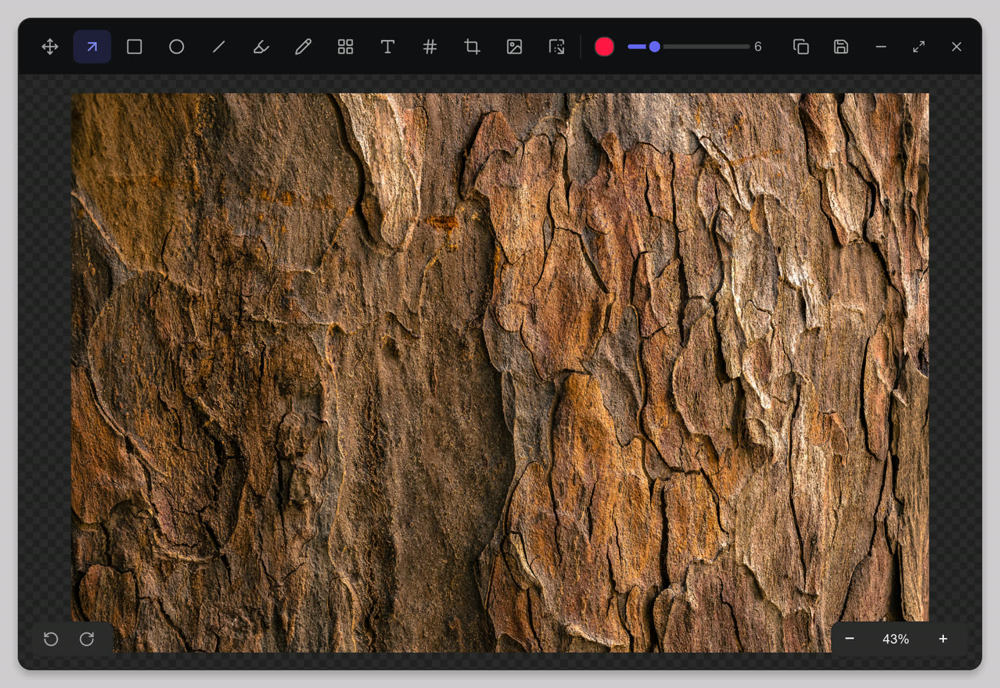
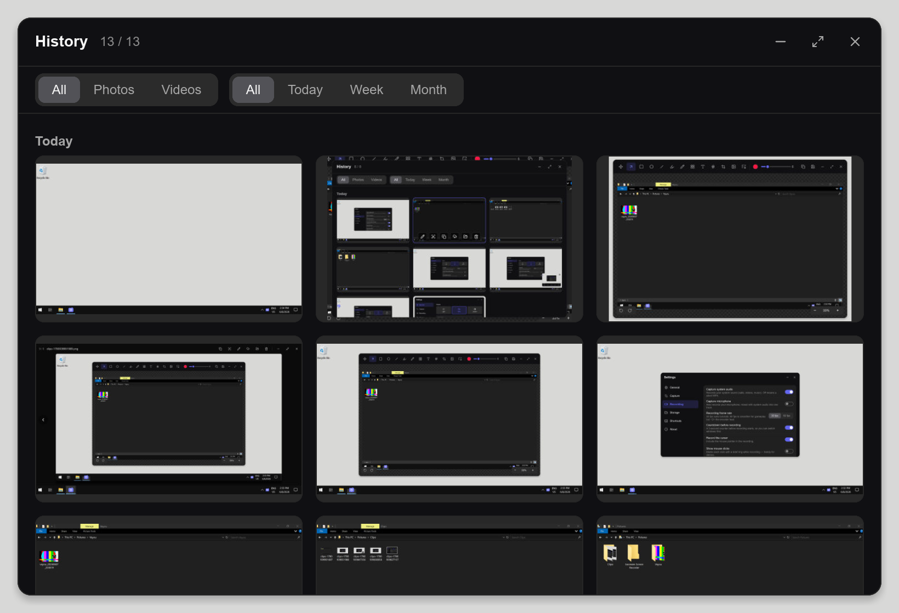
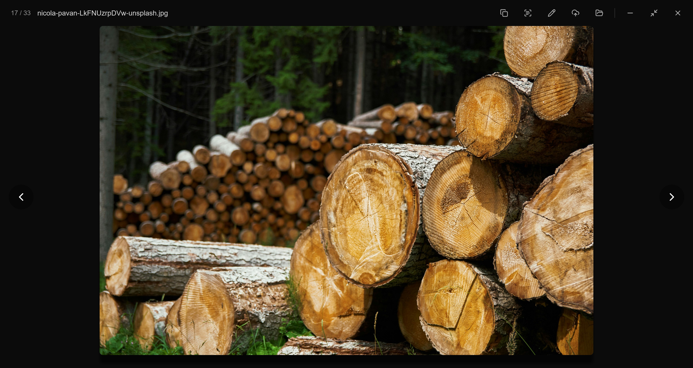
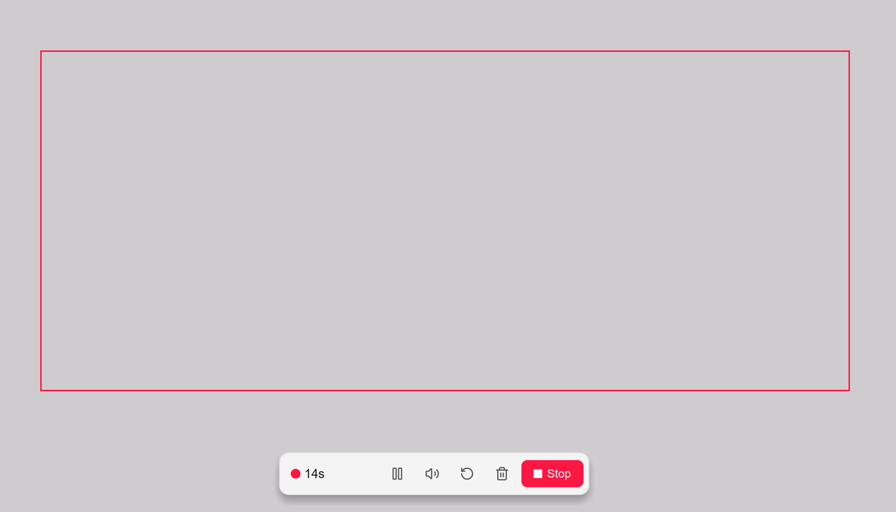
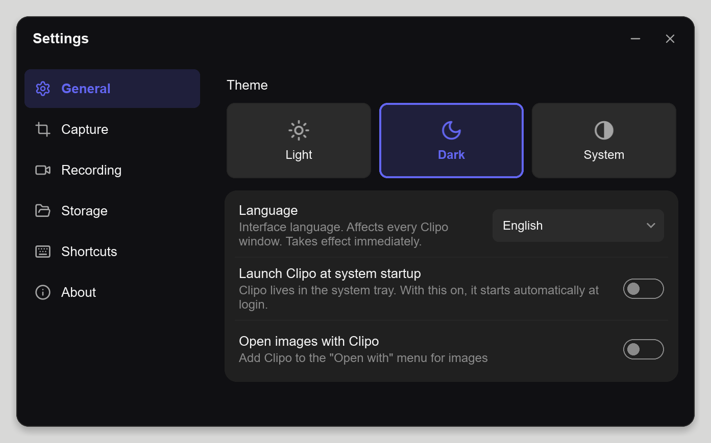
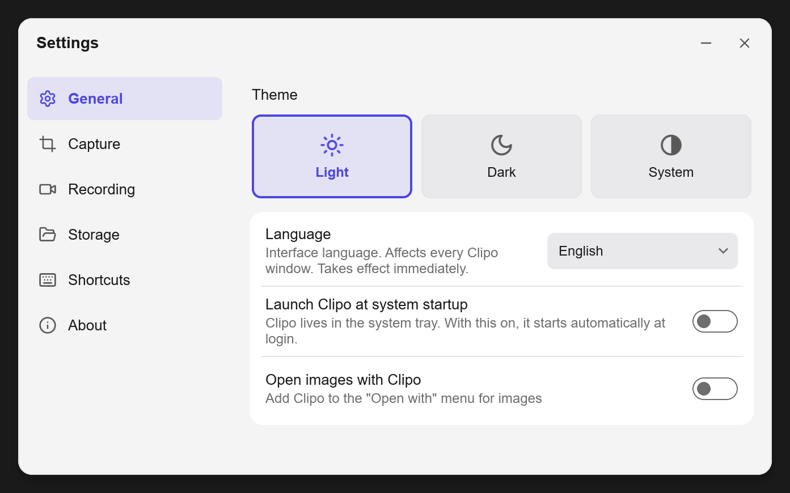

<div align="center">

# Clipo

**Fast, lightweight native Windows screenshot + screen recording.**

Capture a region, window or the whole screen, annotate it, record video with audio,
run OCR, and share — all from the tray, in a **single process** (no per-window
renderers). Built in **Rust + [Slint](https://slint.dev)**.

[](LICENSE)
&nbsp;
&nbsp;
&nbsp;

[Download](#download)&nbsp;·&nbsp;[Features](#features)&nbsp;·&nbsp;[Shortcuts](#keyboard-shortcuts)&nbsp;·&nbsp;[Build](#build-from-source)

</div>


https://github.com/user-attachments/assets/51b3c41c-c88d-4259-baa1-4ef6fffd289d


## Features

### Capture
- **Region** — drag-to-select on a frozen screen, with a live 4× **magnifier loupe** and a **dimensions** badge
- **Full screen** and **specific window** (hover-to-highlight window picker)
- **Self-timer** with a centered countdown
- Auto-save as **PNG or JPEG**, auto-copy to clipboard, and a **post-capture panel** (thumbnail + quick actions: copy · edit · OCR · reveal · open · upload) that auto-dismisses

### Recording
- **Region or full screen**, **system audio + microphone**, **30 / 60 fps**
- Optional pre-recording **countdown**, a **frame** drawn around the recorded region, and a floating **control bar** (pause · stop · mute audio · mute mic · restart · discard)
- Global **F-key shortcuts** while recording, and **GIF export** (via a bundled ffmpeg sidecar)

### Edit & extract
- **Annotation editor** — arrows, rectangle, ellipse, line, highlighter, pen, text, numbered counters, blur / pixelate, crop, plus **framing & background** (solid / gradient / blur, padding, radius, aspect, shadow). Undo **and redo**.
- **OCR** — extract text from any region (`Windows.Media.Ocr`), `Ctrl+Shift+T`

### Organize & share
- **History** — a filterable gallery of past captures & recordings, with per-item actions and an in-app viewer that **animates GIFs**
- **Cloud upload (bring-your-own keys)** — upload to *your* Cloudflare R2 or any S3-compatible bucket; the public link is copied to the clipboard, and an already-uploaded capture offers **"copy link"** instead of re-uploading
- **Automatic updates** — checks GitHub for a newer release and installs it after **verifying its minisign signature** (Settings → About)

### Quality of life
- **All-in-one menu** (`Ctrl+Shift+K`) — a grid of every capture mode
- Single-instance (no stacked tray copies), **"Open with Clipo"** file association, launch-at-startup, **12 languages**, and a light / dark / system theme
- Single process → low idle RAM; rounded, themed, borderless windows

---

## Screenshots

<table>
  <tr>
    <td colspan="2"><br><sub><b>All-in-one menu (Ctrl + Shift + K)</b></sub></td>
  </tr>
  <tr>
    <td width="50%"><br><sub><b>Annotation editor</b></sub></td>
    <td width="50%"><br><sub><b>History</b></sub></td>
  </tr>
  <tr>
    <td><br><sub><b>Image viewer</b></sub></td>
    <td><br><sub><b>Recording bar</b></sub></td>
  </tr>
  <tr>
    <td><br><sub><b>Settings — dark</b></sub></td>
    <td><br><sub><b>Settings — light</b></sub></td>
  </tr>
</table>

---

## Download

Grab the latest **`Clipo-Setup.exe`** from the [**Releases**](../../releases/latest) page and run it.

The installer is **per-user — no admin, no UAC**. It installs to
`%LOCALAPPDATA%\Programs\Clipo`, adds Start-menu / desktop shortcuts and an
uninstaller (Add/Remove Programs), and bundles the ffmpeg sidecar for GIF export.
Once installed, Clipo keeps itself up to date.

> **First run:** Clipo isn't code-signed yet, so Windows SmartScreen may show
> *"Windows protected your PC."* It's not malware — click **More info → Run
> anyway** to continue.

---

## Keyboard shortcuts

Global hotkeys (rebindable in **Settings → Shortcuts**):

| Action | Default |
|---|---|
| Capture region | `PrintScreen` |
| Capture full screen | `Shift + PrintScreen` |
| Capture window | `Ctrl + Shift + W` |
| Record screen | `Ctrl + Shift + R` |
| Extract text (OCR) | `Ctrl + Shift + T` |
| All-in-one menu | `Ctrl + Shift + K` |

While recording (fixed):

| Action | Key |
|---|---|
| Stop | `F8` |
| Pause / resume | `F9` |
| Restart | `F10` |
| Mute system audio | `F7` |
| Mute microphone | `F6` |

---

## Cloud upload

Optional and **bring-your-own-keys** — no developer account, you control billing
and data. In **Settings → Storage → Cloud upload**, pick **Cloudflare R2** or any
**S3-compatible** provider and enter your access key, secret, bucket and public
URL. After a capture, **Upload** signs the request with AWS Signature V4 and
copies the public link to your clipboard; URLs are cached so the same file is
never uploaded twice.

---

## Data & config locations

| What | Where |
|---|---|
| Captures (default) | `%USERPROFILE%\Pictures\Clipo` (configurable) |
| Settings | `%LOCALAPPDATA%\Clipo\settings.json` |
| Upload-URL cache | `%LOCALAPPDATA%\Clipo\uploads.json` |
| Thumbnails | `%LOCALAPPDATA%\Clipo\thumbs\` |

---

## Build from source

### Prerequisites
- **Rust** (stable) — install via [rustup](https://rustup.rs/)
- **Microsoft Visual Studio Build Tools** with the *Desktop development with C++* workload

The capture engine (`clipo-core` / `clipo-capture`) is **vendored in-repo** under
`crates/`, so the build is self-contained — no sibling checkout needed.

```sh
cargo build --release
# the exe lands in target/release/clipo.exe
```

GIF export looks for `ffmpeg.exe` next to the executable (or on `PATH`); it's an
optional feature and degrades gracefully when absent.

### Quality gate
```sh
cargo clippy --all-targets   # pedantic + nursery
cargo test                   # unit tests (incl. the AWS SigV4 reference vectors)
```

### Installer
The per-user installer (`Clipo-Setup.exe`) and the `latest.json` auto-update
manifest are produced by the NSIS script + `build.ps1` kept outside this repo.
Signing the release requires [minisign](https://jedisct1.github.io/minisign/);
the matching public key is embedded in the app so a tampered download is rejected
before it runs.

---

## Tech

Rust · Slint (femtovg / GPU) · DXGI Desktop Duplication + Direct3D 11 (zero-copy
capture) · `Windows.Media.Ocr` · WinHTTP + hand-rolled AWS Signature V4 for
uploads · minisign-verified self-update.

## Third-party components

Redistributed binaries / toolkits whose own terms apply, independent of this
project's Apache-2.0 license:

| Component | Terms |
|---|---|
| **FFmpeg** (`ffmpeg.exe`, bundled for GIF export) | LGPL-2.1-or-later or GPL, depending on the build. Source: [ffmpeg.org](https://ffmpeg.org) |
| **Slint** (UI toolkit) | Subject to Slint's own licensing — GPLv3, royalty-free, or commercial. See [slint.dev](https://slint.dev) |

## License

[Apache-2.0](LICENSE) © Ohgawa.
